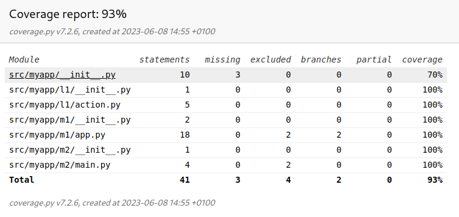
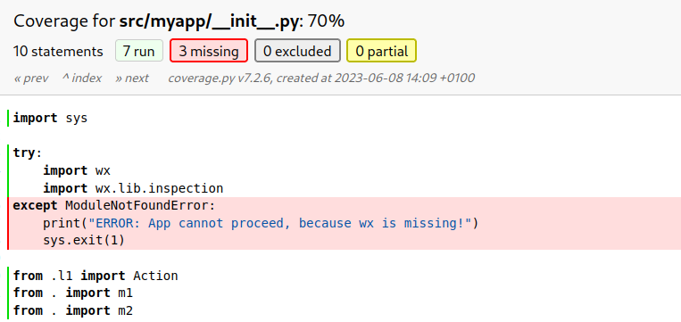
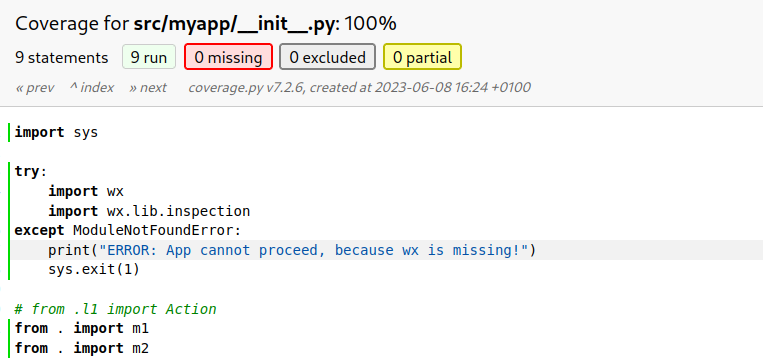

= My Python Coverage Demo Project

ifdef::env-github[:outfilesuffix: .adoc]

This is a Python project to help me showing the problems I am having in other large project, https://github.com/robotframework/RIDE[RIDE].

== The Problem ==

I am trying to increase the test coverage of RIDE, and I have created one unit test, to verify the exception execution block, of the main RIDE module, when the import of https://wxpython.org[wxPython] fails. This is a critical library that RIDE needs to function, so some help is shown to the user when it fails to import.

I have create the test, using `MonkeyPatch()` from `pytest`, to replace the original ``builtins.\_\_import__`` method and causing the expected exception to a known import in the module under test. It worked fine, the unit test ran the test and returned the expected result, and the code after the exception catch did not run.

The problem was when running all unit tests of RIDE to obtain the coverage report, always failed at this test, because wxPython was imported, the exception not triggered and remaining code ran.

After long time doing several experiments, without success, I decided to create this project, in the hope that someone can help me having a solution to proceed with my goal of having 100% coverage for the main module, and increase coverage in RIDE project.

== Experiments ==

OK, I have done a lot of searches in WWW, and learned about the Python Cache (which is a good idea for applications, but not for my tests ;) ). I tried to:

- manipulate ``sys.path`` by removing the ``wx`` from it
- manipulate ``sys.module`` by removing ``wx`` from it
- use ``pytest`` methods to make ``wx`` not discoverable
- delete the cache so it never has ``wx`` when running my test

At first I have suspected of ``coverage`` being responsible for always find ``wx`` when running the test, but later I concluded that ``pytest`` was the one always finding ``wx``.

I RIDE project I always have failure when running ``pytest`` with more than the set of tests for the main module. Specifically, if I run ``pytest utest/application/test_app_main.py`` alone, the 13 tests passes. If I run with other tests, and no matter what order I use, like in, ``pytest utest/application/test_app_main.py utest/application/test_robot_patches.py`` the relevant and first test fails, and 16 passes.

== This Demo Project ==

I have been testing this demo project and RIDE, in Fedora 38, Python 3.11, wxPython 4.2.2, pytest-7.3.1, pluggy-1.0.0 and plugin: cov-4.1.0 and coverage 7.2.6.
 
To be able to test this project, you can install the requirements with:

  pip install -r requirements.txt

The file tree is:

  .
  ├── cover.sh
  ├── doc
  │   ├── coverage_report.png
  │   ├── detail_of_fully_covered.png
  │   └── detail_of_uncovered.png
  ├── README.adoc
  ├── requirements.txt
  ├── src
  │   └── myapp
  │       ├── __init__.py
  │       ├── l1
  │       │   ├── action.py
  │       │   └── __init__.py
  │       ├── m1
  │       │   ├── app.py
  │       │   └── __init__.py
  │       └── m2
  │           ├── __init__.py
  │           └── main.py
  └── utests
      ├── l1
      │   └── test_l1.py
      ├── m1
      │   └── test_m1.py
      └── m2
          └── test_m2.py


The script ``cover.sh`` is just my helper script to run coverage:

```
  #!/usr/bin/bash
  
  PYTHONROOT=/usr/bin PYTHONPATH./src:./utests coverage run -m pytest -k test_ -v .
  
  coverage report
  coverage xml
  coverage html
```
== Running the tests

You can run the tests with ``pytest`` and in this small project they only fail when the ``l1`` is run before ``m1``.

Pass:

  PYTHONPATH=./src:./utests pytest utests/m1/test_m1.py utests/m2/test_m2.py utests/l1/test_l1.py

Fail:

  PYTHONPATH=./src:./utests pytest utests/l1/test_l1.py utests/m1/test_m1.py utests/m2/test_m2.py

(this different execution order always cause fail in the case of RIDE tests)

**NOTE:** You may want to add ``--capture=tee-sys`` after the command ``pytest``, to see the tests output.

== Coverage Report ==

The goal is to have, at least, 80% code coverage on my RIDE project (the default Sonar Cloud Quality Gate setting), but on this project I should have 100% coverage.

Output of ``cover.sh``:


  $ ./cover.sh
  (...)
  Name                       Stmts   Miss Branch BrPart  Cover
  ------------------------------------------------------------
  src/myapp/__init__.py         10      3      0      0    70%
  src/myapp/l1/__init__.py       1      0      0      0   100%
  src/myapp/l1/action.py         5      0      0      0   100%
  src/myapp/m1/__init__.py       2      0      0      0   100%
  src/myapp/m1/app.py           18      0      2      0   100%
  src/myapp/m2/__init__.py       1      0      0      0   100%
  src/myapp/m2/main.py           4      0      0      0   100%
  ------------------------------------------------------------
  TOTAL                         41      3      2      0    93%
  Wrote XML report to ./.coverage-reports/coverage.xml
  Wrote HTML report to ./.coverage-reports/htmlcov/index.html

In browser:



Detail of uncovered code:



---

After removing the ``l1`` module, tests and references, I get 100% coverage:

  $ ./cover.sh
  (...)
  Name                       Stmts   Miss Branch BrPart  Cover
  ------------------------------------------------------------
  src/myapp/__init__.py          9      0      0      0   100%
  src/myapp/m1/__init__.py       2      0      0      0   100%
  src/myapp/m1/app.py           18      0      2      0   100%
  src/myapp/m2/__init__.py       1      0      0      0   100%
  src/myapp/m2/main.py           4      0      0      0   100%
  ------------------------------------------------------------
  TOTAL                         34      0      2      0   100%
  Wrote XML report to ./.coverage-reports/coverage.xml
  Wrote HTML report to ./.coverage-reports/htmlcov/index.html
 
Detail of covered code:



== Will You Help Me?

If you have a solution to improve the unit test in ``m1``, without changing the code of the "app", please, please, tell me :).

I don't want a solution that would need for me to reorder the tests, by renaming them, or forcing order execution.

(Now that I think about forcing order execution, I think ``pytest`` has something for it image:https://www.clipartkey.com/mpngs/m/299-2997890_rubber-duck-emoji-png.png[rubber_duck,80,64] )
